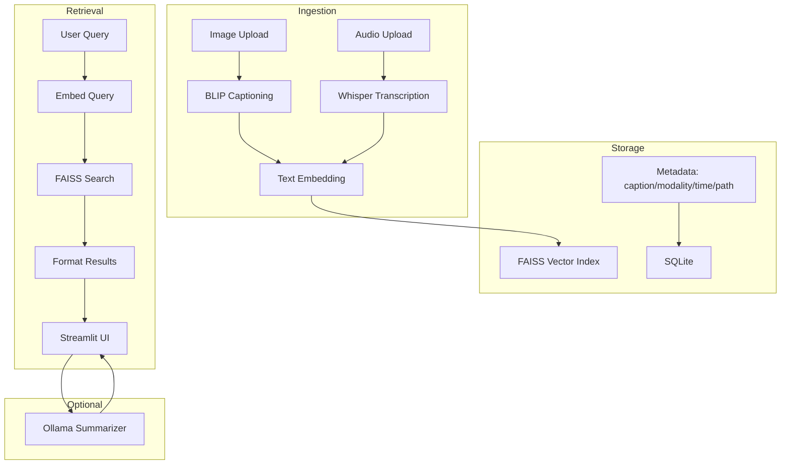
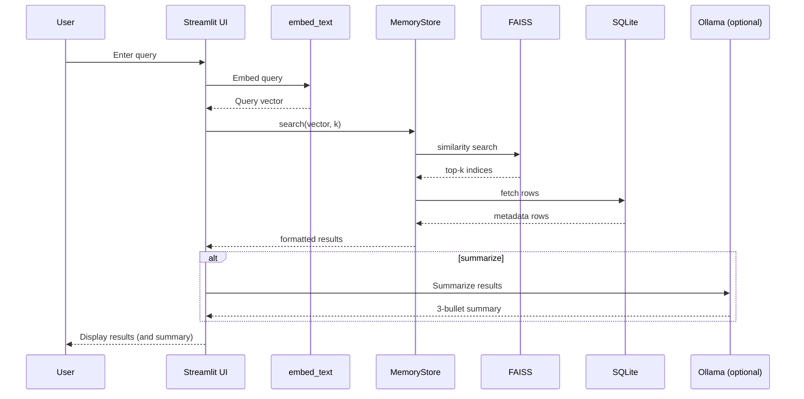
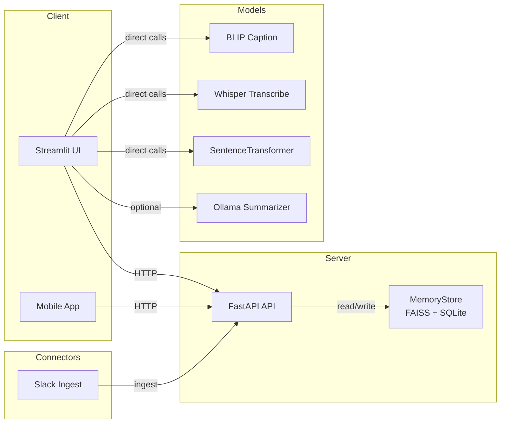

# PrivateRecall — Multimodal AI Assistant

PrivateRecall is a privacy-first “second brain” that runs entirely on your device. It captures screenshots and voice notes, creates searchable embeddings, and lets you recall moments with natural language — no cloud required.

## Highlights
- On-device multimodal ingestion: image captioning (BLIP) and speech-to-text (Whisper)
- Local retrieval: FAISS vector search + SQLite metadata
- Simple UI: Streamlit app for upload, search, and weekly reflections
- Optional local LLM (Ollama) for summaries

## Quickstart
```bash
git clone https://github.com/ManasaPantra/PrivateRecall.git
cd PrivateRecall
python3 -m venv .venv && source .venv/bin/activate
python -m pip install --upgrade pip
pip install -r requirements.txt
bash run_app.sh
```
Open http://localhost:8501

## Configuration (optional)
Create a `.env` for any connectors/tokens you use (kept local):
```
SQLITE_DB_PATH=data/memories.sqlite3
FAISS_DB_PATH=data/memories.faiss
# SLACK_BOT_TOKEN=...
```

## Project Structure
```
app/              # Streamlit UI and retrieval flow
models/           # BLIP captioning, Whisper, and embeddings
tests/            # Basic tests
run_app.sh        # Launches the UI
```

## Architecture Overview



### How it works
- Ingestion: Images are captioned via BLIP; audio is transcribed via Whisper. The resulting text is embedded with SentenceTransformers.
- Storage: Embeddings go to a FAISS index for similarity search; captions and metadata are stored in SQLite.
- Retrieval: A query is embedded and searched against FAISS; matching rows are fetched from SQLite and displayed. Optionally, results are summarized with a local LLM (Ollama).

### Sequence: Retrieval Path



### Component View (API and Connectors)



## Optional: Local LLM (Summaries)
To generate on-device summaries, install and run Ollama:
```bash
brew install ollama
ollama serve
ollama pull llama3:instruct
```

## Optional: Performance & Optimize
You can tune models for speed using environment variables (set in your shell or `.env`):
```
# Embeddings
EMBED_MODEL=all-MiniLM-L6-v2
EMBED_NORMALIZE=1

# BLIP (caption)
BLIP_MODEL=Salesforce/blip-image-captioning-base
BLIP_MAX_TOKENS=16
BLIP_HALF=1

# Whisper (transcription)
WHISPER_SIZE=tiny   # tiny|base|small
WHISPER_DEVICE=cpu  # cpu|cuda
WHISPER_COMPUTE=int8
```

Tips:
- Use Whisper `tiny` with `int8` for fast transcription.
- Reduce BLIP `BLIP_MAX_TOKENS` and enable half precision when supported.
- Keep embeddings normalized for stable retrieval.

## Optional: Benchmarking & Metrics
If you add timing around the retrieval path (embed → FAISS search), target total latency < 300 ms.
- Example approach: time the two steps and log to a table in the UI.
- For a fuller example of metrics/benchmark pages, see the “clean” reference implementation you created earlier.

## Maintainer
Manasa

## License
Choose a license (e.g., MIT) and add a LICENSE file.
